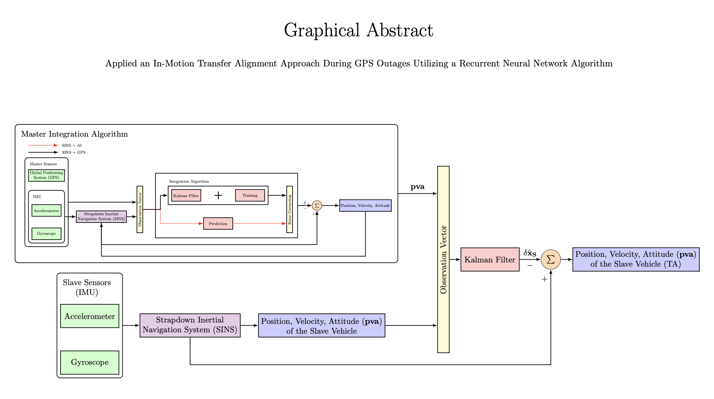

# INS-AI

A collection of sensor-fusion and machine-learning modules for an Unmanned Surface Vehicle (USV) platform.  
This project includes GPS/INS integration, predictive deep-learning models, hyperparameter tuning scripts, and data-generation utilities.



---

## Table of Contents

- [Features](#features)  
- [Getting Started](#getting-started)  
  - [Prerequisites](#prerequisites)  
  - [Installation](#installation)  
- [Usage](#usage)  
  - [Jupyter Notebooks](#jupyter-notebooks)  
  - [MATLAB Scripts](#matlab-scripts)  
  - [PureBasic Demos](#purebasic-demos)  
- [Repository Structure](#repository-structure)  
- [Contributing](#contributing)  
- [License](#license)  

---

## Features

- **GPS_INS**  
  Sensor fusion of GPS and Inertial Navigation System data for improved positioning.
- **PNN**  
  Probabilistic Neural Network implementations for classification and regression tasks.
- **LSTM**  
  Long Short-Term Memory models for sequence prediction, path planning, and anomaly detection.
- **Tuning**  
  Hyperparameter-search routines (grid search, random search, Bayesian optimization) to optimize model performance.
- **data_created**  
  Scripts and notebooks for dataset generation, augmentation, and preprocessing.

---

## Getting Started

### Prerequisites

- **Python** 3.8 or higher  
- **Jupyter Notebook** or **JupyterLab**  
- **MATLAB** R2020b or later (for `.m` scripts)  
- **PureBasic** compiler (for PureBasic demos)

### Installation

1. **Clone the repository**  
   ```bash
   git clone https://github.com/alibaniasad1999/otter-USV.git
   cd otter-USV
   ```

2. **(Optional) Create & activate a virtual environment**  
   ```bash
   python -m venv venv
   # Linux/macOS
   source venv/bin/activate  
   # Windows
   venv\Scripts\activate.bat
   ```

3. **Install Python dependencies**  
   ```bash
   pip install -r requirements.txt
   ```

---

## Usage

### Jupyter Notebooks

1. Launch Jupyter:  
   ```bash
   jupyter notebook
   # or
   jupyter lab
   ```
2. Open any `.ipynb` in the `GPS_INS/`, `PNN/`, `LSTM/`, `Tuning/`, or `data_created/` folders and run cells interactively.

### MATLAB Scripts

1. Open MATLAB.  
2. Navigate to the folder containing `.m` scripts.  
3. Run scripts cell-by-cell or as a whole to reproduce plots and analyses.

### PureBasic Demos

1. Open the `.pb` source files in PureBasic IDE.  
2. Compile and run to see real-time demos of sensor-fusion algorithms.

---

## Repository Structure

```
otter-USV/
├── GPS_INS/           # GPS + INS sensor-fusion notebooks & scripts
├── PNN/               # Probabilistic Neural Network implementations
├── LSTM/              # LSTM sequence prediction models
├── Tuning/            # Hyperparameter tuning utilities
├── data_created/      # Data generation & preprocessing scripts
├── .gitignore
├── LICENSE            # MIT License
├── README.md          # This file
└── requirements.txt   # Python dependencies
```

---

## Contributing

We welcome contributions! Please follow these steps:

1. **Fork** the repository.  
2. **Create** a new branch:
   ```bash
   git checkout -b feature/YourFeatureName
   ```
3. **Commit** your changes:
   ```bash
   git commit -m "Add feature: YourFeatureName"
   ```
4. **Push** to your fork:
   ```bash
   git push origin feature/YourFeatureName
   ```
5. **Open** a Pull Request against the `main` branch.

Please ensure your code is well-documented, tested, and follows the existing style.

---

## License

Distributed under the MIT License. See [LICENSE](LICENSE) for details.
